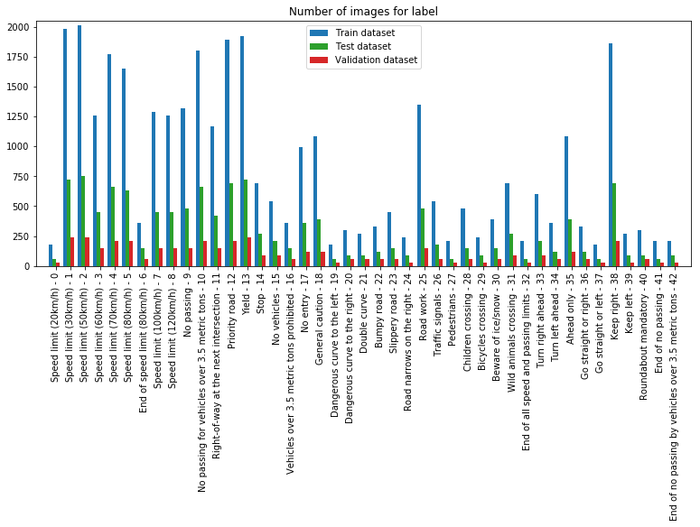
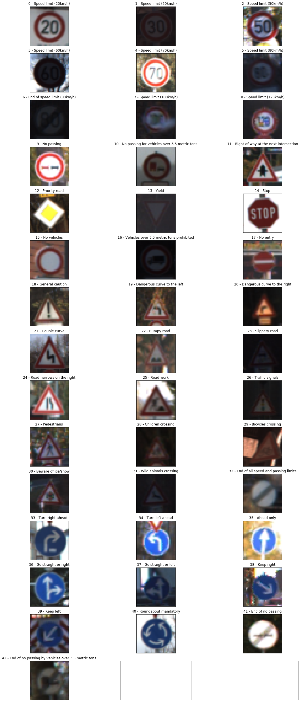
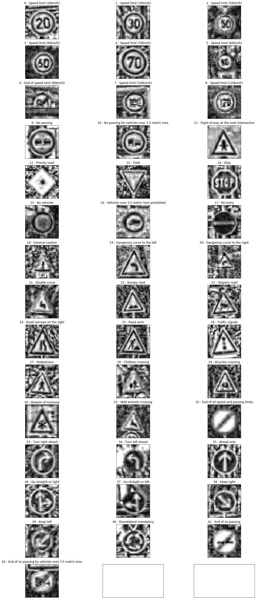
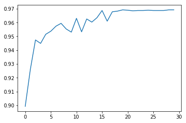
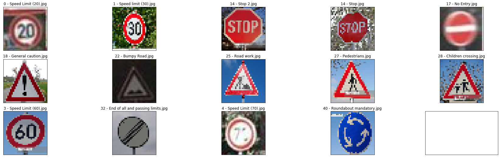
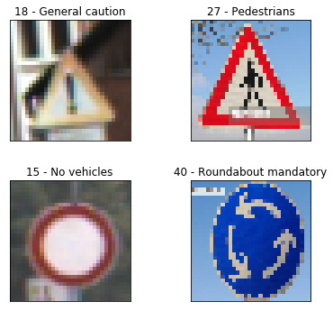
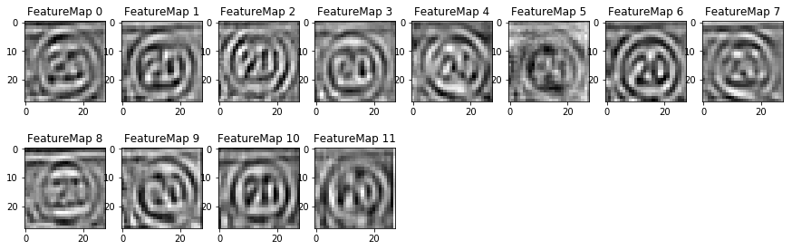

# **Traffic Sign Recognition**

## Writeup

**Build a Traffic Sign Recognition Project**

The goals / steps of this project are the following:
* Load the data set (see below for links to the project data set)
* Explore, summarize and visualize the data set
* Design, train and test a model architecture
* Use the model to make predictions on new images
* Analyze the softmax probabilities of the new images
* Summarize the results with a written report

## Rubric Points
###Here I will consider the [rubric points](https://review.udacity.com/#!/rubrics/481/view) individually and describe how I addressed each point in my implementation.  

---
### Writeup / README

#### 1. Provide a Writeup / README that includes all the rubric points and how you addressed each one. You can submit your writeup as markdown or pdf. You can use this template as a guide for writing the report. The submission includes the project code.

You're reading it! and here is a link to my [project code](https://github.com/udacity/CarND-Traffic-Sign-Classifier-Project/blob/master/Traffic_Sign_Classifier.ipynb)

### Data Set Summary & Exploration

#### 1. Provide a basic summary of the data set. In the code, the analysis should be done using python, numpy and/or pandas methods rather than hardcoding results manually.

I used the pandas library to calculate summary statistics of the traffic
signs data set:

* The size of training set is 34799
* The size of the validation set is 4410
* The size of test set is 12630
* The shape of a traffic sign image is (32, 32, 3)
* The number of unique classes/labels in the data set is 43

#### 2. Include an exploratory visualization of the dataset.

This is the distribution for the 3 datasets: training, validation and test.

This is a sample image for each of the different classes.

### Design and Test a Model Architecture

#### 1. Describe how you preprocessed the image data. What techniques were chosen and why did you choose these techniques? Consider including images showing the output of each preprocessing technique. Pre-processing refers to techniques such as converting to grayscale, normalization, etc. (OPTIONAL: As described in the "Stand Out Suggestions" part of the rubric, if you generated additional data for training, describe why you decided to generate additional data, how you generated the data, and provide example images of the additional data. Then describe the characteristics of the augmented training set like number of images in the set, number of images for each class, etc.)

For the preprocessing, I converted all the images to one only channel, taking only the `Y` channel from the `YcbCr`. I made this because according to Pierre Sermanet and Yann Lecun on [their paper](http://yann.lecun.com/exdb/publis/pdf/sermanet-ijcnn-11.pdf), using color channels don't improve significantly and add another layer of complexity in the calculation.
Also I applied a [histogram equalization](https://en.wikipedia.org/wiki/Adaptive_histogram_equalization) to enhance the contrast that helps the feature extraction.

Here you can see a image of the different classes after the preprocessing.

#### 2. Describe what your final model architecture looks like including model type, layers, layer sizes, connectivity, etc.) Consider including a diagram and/or table describing the final model.

My final model consisted of the following layers:

| Layer         		|     Description	       |
|:---------------------:|:---------------------------------------------:|
| Input         		| 32x32x1 Grayscale image   |
| Convolution 3x3   | 1x1 stride, valid padding, outputs 28x28x12 |
| RELU					|						|
| Max pooling	      	| 2x2 stride,  outputs 14x14x12  |
| Convolution 3x3	| 2x2 stride, valid padding, outputs 14x14x32 |   
| RELU					|	 |
| Max pooling	      	| 2x2 stride,  outputs 5x5x32 |
| Fully connected	| Input: 800 Output: 512 |
| RELU					|	|
| Fully connected	| Input: 512 Output: 256 |        
| RELU					|						|
| Fully connected	| Input: 256 Output: 43 (`n_classes`)|
| Softmax				|         	|

#### 3. Describe how you trained your model. The discussion can include the type of optimizer, the batch size, number of epochs and any hyperparameters such as learning rate.

To train the model, I used an 30 epochs, although we raised a plateau around the 20th epoch. We have used AdamOptimizer with a learning rate of 0.001 and after different trials this has been the one that I obtained best results.

The results for these values were:
 * Validation Accuracy: 96.9%
 * Test Accuracy: 95.6%

 Here is a graph representing the valid accuraccy in the different epochs

 

#### 4. Describe the approach taken for finding a solution and getting the validation set accuracy to be at least 0.93. Include in the discussion the results on the training, validation and test sets and where in the code these were calculated. Your approach may have been an iterative process, in which case, outline the steps you took to get to the final solution and why you chose those steps. Perhaps your solution involved an already well known implementation or architecture. In this case, discuss why you think the architecture is suitable for the current problem.

My final model results were:
* training set accuracy of ?
* validation set accuracy of ?
* test set accuracy of ?

If an iterative approach was chosen:
* What was the first architecture that was tried and why was it chosen?
* What were some problems with the initial architecture?
* How was the architecture adjusted and why was it adjusted? Typical adjustments could include choosing a different model architecture, adding or taking away layers (pooling, dropout, convolution, etc), using an activation function or changing the activation function. One common justification for adjusting an architecture would be due to overfitting or underfitting. A high accuracy on the training set but low accuracy on the validation set indicates over fitting; a low accuracy on both sets indicates under fitting.
* Which parameters were tuned? How were they adjusted and why?
* What are some of the important design choices and why were they chosen? For example, why might a convolution layer work well with this problem? How might a dropout layer help with creating a successful model?

If a well known architecture was chosen:
* What architecture was chosen?
* Why did you believe it would be relevant to the traffic sign application?
* How does the final model's accuracy on the training, validation and test set provide evidence that the model is working well?

### Test a Model on New Images

#### 1. Choose five German traffic signs found on the web and provide them in the report. For each image, discuss what quality or qualities might be difficult to classify.

I downloaded 14 images from the web that are shown in the next picture

At the beginning I tried to use only 5 images but I got 100% of successful prediction so I tried to add more images. I chose those images to be very similar like triangle shaped signs, or circular signs. Also I chose some blurred images like the speed limit (70 km/h)d, End of all limits or No Entry signs. I also tried with Dark images like bumpy road sign.

#### 2. Discuss the model's predictions on these new traffic signs and compare the results to predicting on the test set. At a minimum, discuss what the predictions were, the accuracy on these new predictions, and compare the accuracy to the accuracy on the test set (OPTIONAL: Discuss the results in more detail as described in the "Stand Out Suggestions" part of the rubric).

Here are the results of the prediction:

| | 	|	  | 	|	 |	 | 	| | | | | | | | |
|:----:|------|------| ------|------|------| ------| ------| ------|------|------|------| ------|------|------|
| sign |	0 |	 1 | 	14 | 	14 |	17 | 	18 |	 22 | 	25 |	 27 |	 28 |	 3 | 	32 | 	4 | 	40 |
| prediction | 	0 |	 1 | 	14 |	 14 |	 17 | 	18 | 	22 | 	25 |	 18 |	 28 |	 3 | 	32 |	 4 | 	15 |
| succ |	 True |	 True |	 True |	 True |	 True | 	True | 	True | 	True | 	**False** |	 True | 	True | 	True | 	True | 	**False** |

So as we can see the model predicted successfully 12 out of 14 traffic signs giving an accuracy for this dataset of 85.7%. Obviously this accuracy is lower that the the test accuracy due to the quantity of images is only 14.

The two images that the model failed to predict are

As we can see, the model predicted successfully the dark images and the blurred images, even the speed limit (70 km/h) which I considered quite hard to predict. It failed to predict the pedestrian sign but the picked sign (general caution) is very similar to the real sign. Same thing with the last image (roundabout) that failed with the No vehicles sign, both signs share some similarities.

#### 3. Describe how certain the model is when predicting on each of the five new images by looking at the softmax probabilities for each prediction. Provide the top 5 softmax probabilities for each image along with the sign type of each probability. (OPTIONAL: as described in the "Stand Out Suggestions" part of the rubric, visualizations can also be provided such as bar charts)

The code for making predictions on my final model is located in the 11th cell of the Ipython notebook.

| Sign class | 1st | 2nd | 3rd |
|:----:|:----:|:----:|:----:|:----:|
| 0  | **0** - (0.609668732)  | **4** - (0.389714181) | **1** (0.0006170)|
| 1  | **1** - (0.999938369)  | **5** - (0.000058913) | **6** (0.0000028)|
| 14 | **14** - (0.996541321) | **38** - (0.00255111) | **17** (0.0008238)|
| 14 | **14** - (0.99904752) | **15** - (0.00007329) | **33** (0.0000142)|
| 17 | **17** - (1.00000000) | **14** - (0.0000) | **9** (0.0000)|
| 18 | **18** - (1.00000000) | **11** - (0.0000) | **27** (0.0000)|
| 22 | **22** - (0.94420230) | **29** - (0.0039376) | **25** (0.001641)|
| 25 | **25** - (0.816810727) | **30** - (0.087566) | **22** (0.052778)|
| 27 | **18** - (0.671958506) | **27** - (0.327585) | **11** (0.0004564)|
| 28 | **28** - (1.00000000) | **29** - (0.0000) | **30** (0.0000)|
| 3  | **3** - (0.999999642)  | **18** - (0.00000019) | **2** (0.00000017)|
| 32 | **32** - (0.977564394) | **15** - (0.0218184) | **18** (0.0004681)|
| 4  | **4** - (0.993028939)  | **1** - (0.00697111) | **15** (0.00000003)|
| 40 | **15** - (0.956800878) | **12** - (0.0418255) | **5** (0.0007247)|

We can observe that most of the predictions show a high confidence with more than a 90% for the first option. Even there are 3 images with a probability of 1.  For the sign with class 0 with a 60% where the second option is the sign 4 (Speed limit 70 km/h). Taking a look at the image is easy to see these similarities between both traffic signs.

We can see that for the failed prediction for the sign 27 the first option has 67% while the right options is only 32%.

However with the failed prediction for sign 40, we can see the failed weight has a 95.7% of accuracy which is wrong. This is due to the similarities of both sign to avoid this failure we should improve the processing and the training. To improve the training we must create more training images from the giving dataset applying some layer of transformations to the image.

### (Optional) Visualizing the Neural Network (See Step 4 of the Ipython notebook for more details)
#### 1. Discuss the visual output of your trained network's feature maps. What characteristics did the neural network use to make classifications?

This is the feature map for the first image corresponding to traffic sign class 0 (Speed Limit 20 km/h)

The model successfully shows the different activations parts, like sign shapes and also the inner symbols, in this case the 2 and the 0 are easily visible.
